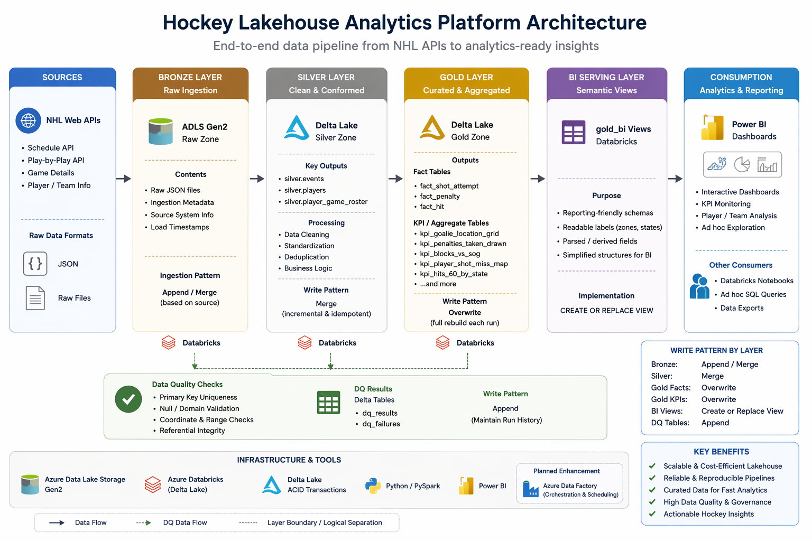
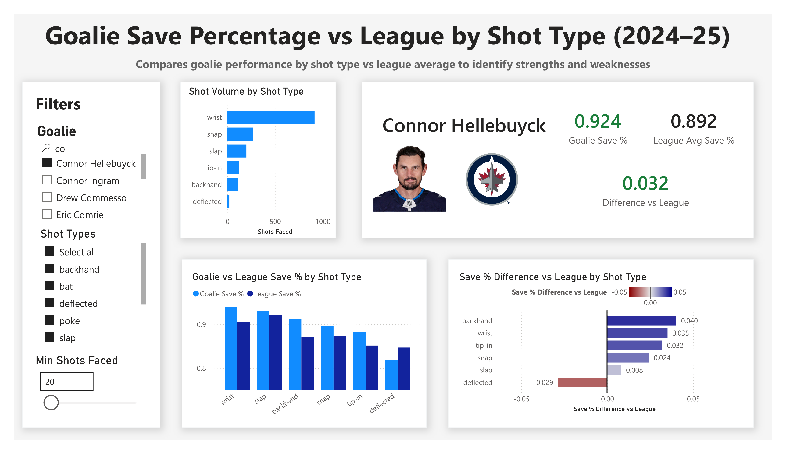
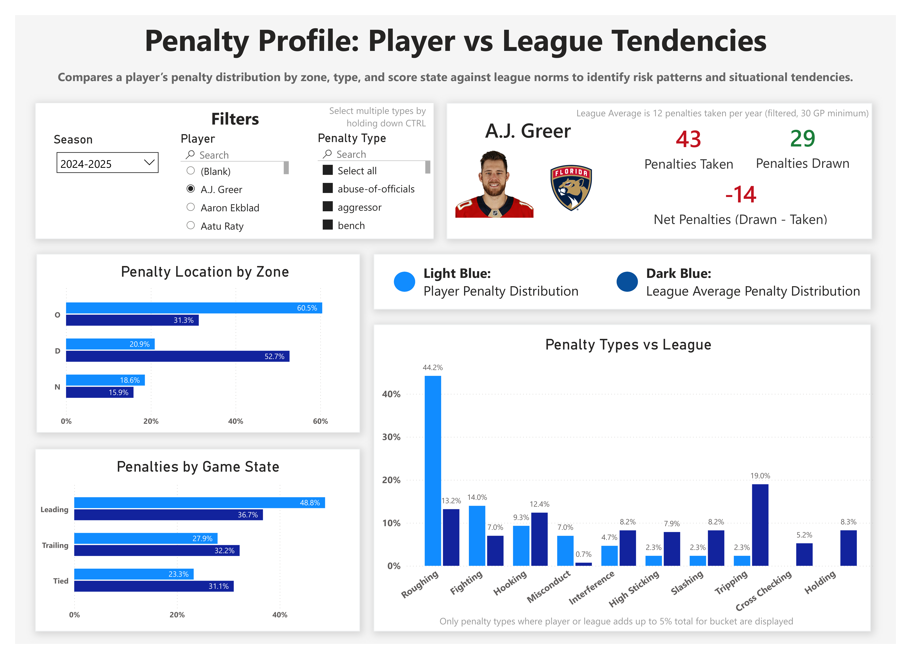
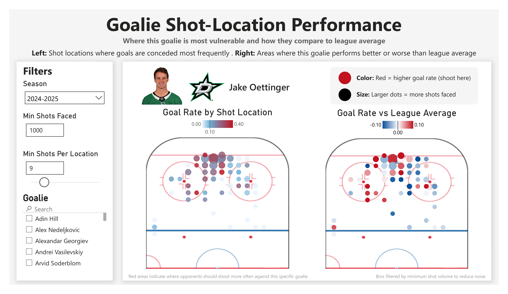
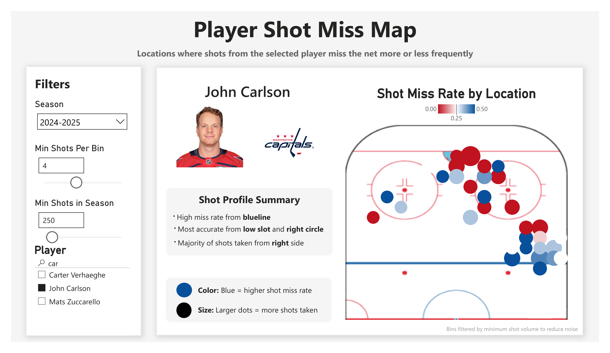
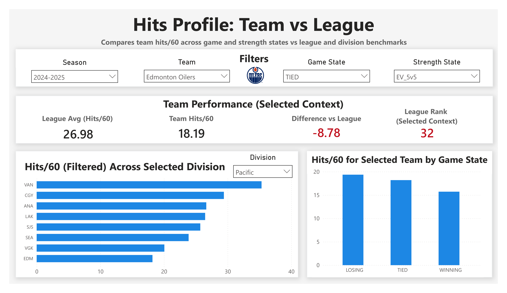

# Hockey Lakehouse Analytics Platform

An end-to-end hockey analytics platform that transforms raw NHL event data into actionable insights for coaching, scouting, and game strategy.

Built on an Azure-based lakehouse architecture (ADLS Gen2 + Databricks + Delta Lake), this project simulates a real-world hockey analytics workflow—where raw data is ingested, modeled, and turned into decision-ready dashboards.

---

## Project Overview

This project focuses on how modern data engineering and analytics can support hockey operations.

Raw NHL data is ingested from public APIs, processed through a Medallion architecture (Bronze → Silver → Gold), and surfaced through interactive Power BI dashboards designed for real decision-making—not just visualization.

The platform enables users to:

- identify how to exploit goalie weaknesses (shot type + location)
- evaluate player discipline and situational risk (penalties)
- analyze shooting efficiency and tendencies (miss maps)
- understand team identity and strategy (hits, playstyle)

Each dashboard is built to answer a specific hockey question, combining:
- contextual filtering (game state, strength state, thresholds)
- league benchmarking
- interactive exploration

The result is a system that mirrors how analysts, coaches, and management teams actually use data to gain a competitive edge.

## Architecture

The platform follows a **lakehouse Medallion Architecture**:

- **Bronze** → raw API ingestion (JSON + Delta)
- **Silver** → cleaned, standardized, and validated datasets
- **Gold** → curated fact tables and KPI aggregates
- **BI Layer** → semantic views + Power BI modeling

This diagram illustrates the end-to-end data flow from NHL APIs through the Medallion lakehouse architecture (Bronze → Silver → Gold) and into Power BI.



👉 For a detailed breakdown, see:  
**[Pipeline Flow](docs/pipeline_flow.md)**  
**[Data Model Overview](docs/data_model_overview.md)**

---

## Key Features

• Event-level hockey data processing  
• Structured Medallion pipelines (Bronze → Silver → Gold)  
• Curated fact tables and KPI aggregates  
• Hybrid BI layer (Databricks + Power BI)  
• Automated data quality validation  
• Interactive Power BI dashboards  

---

## Interactive Hockey Analytics Dashboards

### Performance Overview

Interactive dashboards provide a high-level view of player and team performance across multiple contexts.

---

## Core KPI Dashboards

These dashboards are designed to go beyond surface-level statistics and instead answer real hockey questions:

- Where should we attack this goalie?
- Which players are discipline risks?
- How should we adjust our system against this team?
- Where are players effective vs ineffective?

Each dashboard combines filtering, context, and league comparison to turn raw data into actionable insight.

---

### 1. Goalie Save % vs League by Shot Type

Evaluates how a goalie performs against different shot types relative to league averages.

- Breaks down save % by shot type (wrist, slap, tip-in, deflected, etc.)
- Compares directly to league benchmarks
- Includes shot volume thresholds to ensure reliability
- Supports interactive filtering (clicking shot types updates all visuals)

**Why this matters:**
Not all goalies are beaten the same way — this reveals *how* to score on them.

**Example insight:**
> Opposing shooters: prioritize deflections against Hellebuyck — his save % drops significantly below league average in those situations.



👉 [Deep dive: How to use this dashboard](docs/kpi_deep_dives/goalie_sv_vs_league.md)

---

### 2. Penalty Profile: Player vs League Tendencies

Analyzes a player's penalty behavior across context, not just totals.

- Zone-based penalty distribution (offensive, defensive, neutral)
- Game state impact (leading, tied, trailing)
- Penalty type comparison vs league norms
- Cross-filtering enables multi-dimensional analysis

**Why this matters:**
Penalties are situational — this shows *when, where, and why* players become liabilities.

**Example insight:**
> A.J. Greer takes excessive offensive-zone penalties and commits more penalties when leading — a high-risk, undisciplined profile that could impact team success.



👉 [Deep dive: How to use this dashboard](docs/kpi_deep_dives/penalties_kpi.md)

---

### 3. Goalie Shot-Location Performance

Identifies where a goalie is vulnerable — both in absolute terms and relative to league averages.

- Left chart: raw goal rate by location
- Right chart: performance vs league baseline (true strengths/weaknesses)
- Adjustable bin thresholds to control noise
- Spatial analysis across the offensive zone

**Why this matters:**
Raw shot maps are misleading — this isolates *true weaknesses* compared to other goalies.

**Example insight:**
> Opponents should attack Oettinger from the left circle — he allows more goals than league average from that area, despite being strong in the slot.



👉 [Deep dive: How to use this dashboard](docs/kpi_deep_dives/goalie_location.md)

---

### 4. Shot Miss Map

Visualizes where players miss the net vs shoot accurately, with filtering to control noise.

- Spatial miss rate visualization (blue = misses, red = accuracy)
- Dot size reflects shot volume
- Adjustable thresholds for cleaner insights
- Player-specific shooting tendencies

**Why this matters:**
Shot selection matters — this reveals where players are effective vs inefficient.

**Example insight:**
> John Carlson struggles to hit the net from the blue line but is highly accurate in the right circle — coaches can adjust shot selection accordingly.



👉 [Deep dive: How to use this dashboard](docs/kpi_deep_dives/shot_miss_map.md)

---

### 5. Hits per 60: Team vs League

Compares team physical play across game situations and league context.

- Hits/60 filtered by game state (winning, tied, losing)
- Strength state filtering (5v5, PP, PK, 3v3 OT, etc.)
- Division comparison to evaluate team identity
- Context-aware rankings and league benchmarks

**Why this matters:**
Hits reflect system style — not just effort.

**Example insight:**
> The Oilers rank last in hits/60 when tied at 5v5, indicating a rush-based system — opposing teams can adjust defensive structure accordingly.



👉 [Deep dive: How to use this dashboard](docs/kpi_deep_dives/hits_per_60.md)


---

## Pipelines

This project uses a Medallion lakehouse design in Azure Databricks to transform raw NHL data into analytics-ready outputs.

### Bronze
Raw ingestion from NHL web APIs (schedule and play-by-play).  
Uses a mix of append and merge patterns depending on ingestion grain.

### Silver
Data is cleaned, standardized, and conformed into joinable tables.  
Primarily uses merge-based updates for incremental processing.

### Gold
Curated fact tables and KPI aggregates are built for analytics and reporting.  
Uses overwrite-based rebuilds for consistency and simplicity.

### BI Layer
Databricks provides BI-friendly views, while Power BI handles lightweight semantic modeling (dimensions, measures, relationships).

👉 For full pipeline details:  
**[Pipeline Flow Documentation](docs/pipeline_flow.md)**

---

## Data Model

The data model follows a hybrid dimensional design:

- Core dimensions (player, team) are materialized in Gold
- Fact tables capture event-level data
- KPI tables provide pre-aggregated analytics outputs
- Some semantic dimensions are defined in Power BI

👉 See full model breakdown:  
**[Data Model Overview](docs/data_model_overview.md)**

---

## Technologies Used

Python  
SQL  
Spark / Databricks  
Delta Lake  
Power BI  

---

## Repository Contents

```
architecture/
    Architecture diagrams for the platform

dashboards/
    Power BI dashboard screenshots

pipelines/
    Databricks notebooks and transformation logic

docs/
    KPI deep dives, Data model, pipeline flow, and design documentation
```

---

## Notes

This repository is a **portfolio case study** of a hockey analytics platform.

It demonstrates:
- end-to-end pipeline design
- structured data modeling
- analytics-ready data preparation
- dashboard-driven insights

Some production elements (e.g., full datasets, orchestration) are simplified or simulated.

---

## Future Improvements

- Automated orchestration using Azure Data Factory  
- Scheduled pipeline execution  
- Expanded feature tables for advanced analytics  
- Player tracking and advanced metrics 
