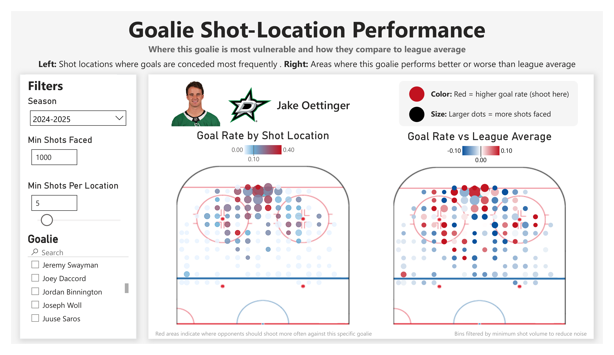

# Goalie Shot-Location Performance — Deep Dive

## Overview

This dashboard analyzes where a goalie concedes goals across the offensive zone and compares their performance to league averages.

It is designed to answer:

- Where is this goalie most vulnerable?
- Where do they outperform league expectations?
- How should opponents adjust shot selection?

---

## Base View

---

## Key Components

### Filters (Left Panel)

**Season**
- Select the season of interest

---

**Minimum Shots Faced**
- Controls which goalies appear in the selection list
- Ensures only goalies with sufficient sample size are analyzed

---

**Minimum Shots per Location**
- Filters out low-volume bins (locations)
- A bin must meet this threshold to appear in the visualization

Purpose:
- reduces noise
- ensures statistical reliability
- improves visual clarity

---

**Goalie Selection**
- Search and select any goalie

---

## Main Visuals

### 1. Goal Rate by Shot Location (Left Chart)

This chart shows:

- how often shots from each location result in goals
- independent of league comparison

Visual encoding:
- **Color**
  - Red → high goal rate (more goals allowed)
  - Blue → low goal rate
- **Size**
  - Larger dots → more shots faced from that location

---

### Important Limitation

While useful, this chart alone is **not sufficient for decision-making**.

Why?

Because:
- all goalies tend to allow more goals from the slot
- all goalies perform better from low-danger areas

👉 This reflects **league-wide tendencies**, not individual weaknesses

---

### 2. Goal Rate vs League Average (Right Chart)

This is the **most important chart**.

It compares the goalie’s performance at each location to the league average.

Visual encoding:
- **Red → worse than league average**
- **Blue → better than league average**

---

### Why This Matters

This chart removes the “expected difficulty” of each shot location.

Instead of asking:
> “Where are goals scored most often?”

It answers:
> “Where is THIS goalie worse than other goalies?”

---

## Key Insight

Using Jake Oettinger as an example:

### Weak Areas

- High goal rates relative to league average in:
  - left circle (goalie’s right side)
  - high slot above the faceoff dots

👉 Interpretation:
These are **target zones for opposing teams**

---

### Strong Areas

- Performs better than league average:
  - directly in front of the net (low slot)
  - slightly to his left in tight

👉 Interpretation:
These are **areas to avoid shooting from**

---

## Tactical Applications

### 1. Offensive Strategy (Opponent)

- Prioritize shots from:
  - left circle
  - high slot

- Avoid:
  - central slot opportunities
  - shooting directly into strength zones

Example:
- On a powerplay:
  - fake shot in slot → pass to left circle
  - exploit identified weakness

---

### 2. Goalie Development

- Identify consistent weak areas
- Focus training on:
  - positioning
  - angle coverage
  - reaction from specific zones

---

### 3. Game Preparation

- Provide pre-game scouting reports
- Adjust shot selection strategy for specific goalies

---

## Effect of Filtering

### Low Threshold (High Noise)

With **min shots per location = 5**:

- Many bins appear
- Visualization becomes cluttered
- Patterns are harder to identify

---

### Proper Threshold (Clear Insights)

With higher thresholds:

- noise is reduced
- meaningful trends emerge
- strengths and weaknesses become obvious

---

## Key Takeaway

This dashboard demonstrates an important principle:

> Raw spatial data is not enough — context is everything.

By comparing performance to league averages, we can:

- isolate true weaknesses
- remove bias from shot difficulty
- generate actionable insights

---

## Summary

This dashboard transforms shot location data into:

- goalie-specific vulnerability maps
- league-relative performance insights
- tactical recommendations for both offense and defense

It enables teams to move from:
- general hockey intuition

to:
- **data-driven shot selection and game planning**
