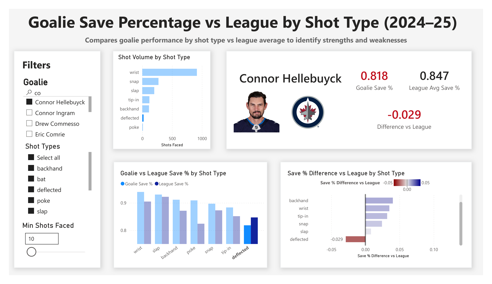

# Goalie Save % vs League by Shot Type - Deep Dive

## Overview

This dashboard compares a goalie's save percentage to league averages across different shot types.

It is designed to:
- identify strengths and weaknesses by shot type
- provide context through shot volume
- enable interactive filtering for deeper analysis

---

## Base View

---

## Key Components

### Filters (Left Panel)

**Goalie Selection**
- Search and select any goalie
- No restrictions (full goalie pool available)

---

**Shot Type Filter**
- Select any combination of shot types (wrist, slap, tip-in, deflected, etc.)
- Default view includes all shot types
- Enables focused analysis (e.g., only high-danger shot types)

---

**Minimum Shots Faced**
- Filters out low-volume shot types
- A shot type must meet the threshold to appear in charts

Purpose:
- reduces noise
- prioritizes statistically meaningful data
- prevents small samples from dominating the visualization

---

## Main Visuals

### 1. Shot Volume by Shot Type

Displays how many shots the goalie has faced for each shot type.

Purpose:
- provides context for reliability
- highlights which shot types have meaningful sample sizes

---

### 2. Goalie vs League Save % by Shot Type

Compares the selected goalie's save percentage to league average for each shot type.

- Each pair of bars represents:
  - Goalie Save %
  - League Average Save %

Insight:
- Quickly identify where the goalie outperforms or underperforms the league

---

### 3. Save % Difference vs League

Shows the difference between the goalie's save % and the league average.

- Blue → better than league
- Red → worse than league
- Includes exact numerical difference

Insight:
- Makes strengths and weaknesses immediately obvious
- Removes the need to mentally compare bar heights

---

### 4. Summary Card (Top Right)

Displays:
- Goalie Save %
- League Average Save %
- Difference vs League

⚠️ Important behavior:
- These values are dynamically filtered based on user interaction

Color logic:
- Green → above league average
- Black → approximately equal
- Red → below league average

---

## Key Insight (Base View)

In the default view:

- The goalie performs at or above league average across most shot types
- However, performance drops for **deflected shots**
- This is visible both visually (shorter bar) and numerically (negative difference)

---

## Interactive Behavior

### Cross-Filtering (Most Important Feature)

The dashboard supports cross-filtering across visuals.

Selecting a shot type in one chart:
- highlights it across all visuals
- filters the summary card
- updates all metrics to reflect only that selection

---

## Example: Isolating Deflected Shots

### What Changed

- Minimum shots faced reduced from 20 → 10  
  → allows lower-volume shot types (e.g., poke) to appear

- User selected **"deflected"** in one chart

---

### Result

All visuals update to reflect **only deflected shots**:

- Summary card updates:
  - Goalie Save % drops significantly
  - Difference vs league becomes negative
  - Card turns red

- Charts confirm:
  - Deflected shots are a clear weakness
  - Performance is below league average

---

## Why This Matters

This dashboard supports multiple hockey use cases:

### 1. Goalie Development

- Identify shot types where a goalie struggles
- Focus training on specific weaknesses (e.g., deflections)

---

### 2. Opponent Scouting

- Identify how to exploit opposing goalies
- Example:
  - If a goalie struggles with deflections → increase net-front presence

---

### 3. Game Strategy

- Adjust shot selection based on goalie tendencies
- Prioritize shot types where the goalie underperforms

---

## Importance of Filtering

This dashboard highlights a key principle:

> Not all data is equally meaningful.

- Low-volume shot types can distort interpretation
- Threshold filtering ensures:
  - cleaner visuals
  - more reliable conclusions

---

## Summary

This dashboard demonstrates how combining:

- contextual volume
- comparative metrics
- interactive filtering

can turn raw event data into actionable insights.

It enables analysts, coaches, and scouts to:
- quickly diagnose goalie tendencies
- validate observations with data
- make more informed tactical decisions
