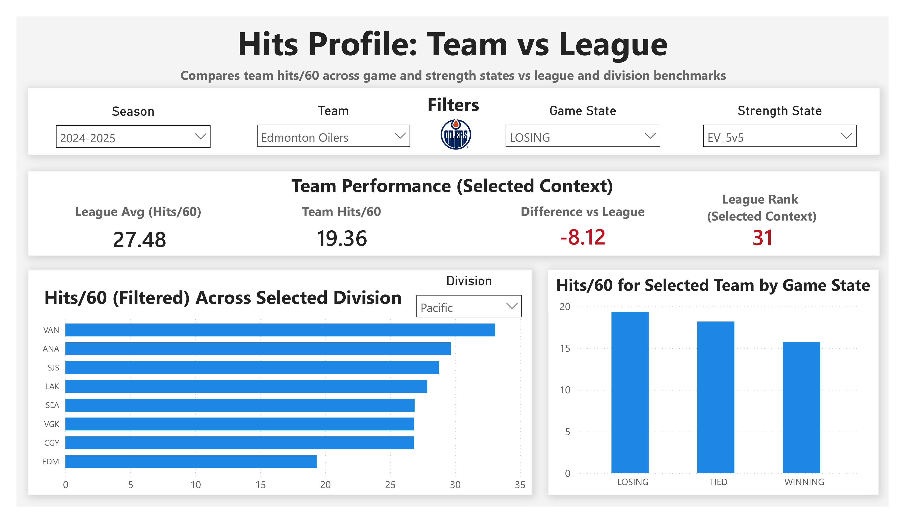
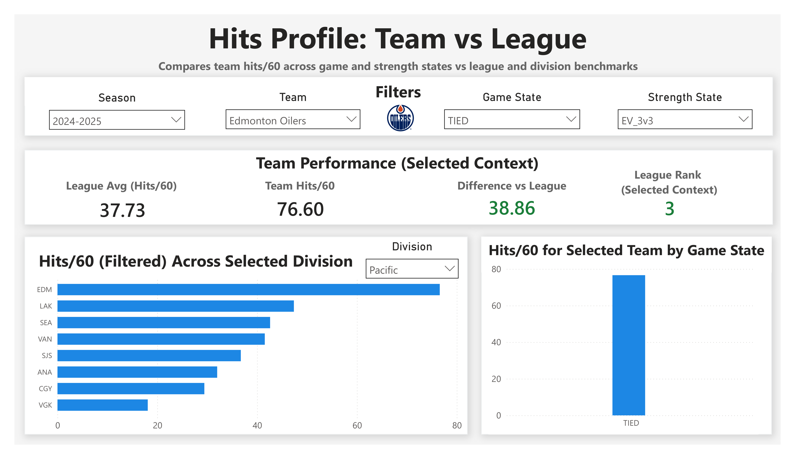

# Hits per 60 — Team vs League — Deep Dive

## Overview

This dashboard compares a team’s physical play (hits per 60 minutes) to league and division benchmarks across different game and strength states.

It is designed to answer:

- How physical is this team relative to the league?
- How does physicality change based on game situation?
- How does this team compare to division rivals?
- What does this reveal about team identity and strategy?

---

## Base View

---

## Key Components

### Filters (Top Panel)

**Season**
- Select the season of interest

---

**Team**
- Choose the team to analyze

---

**Game State**
- Losing
- Tied
- Winning

---

**Strength State**
- Even strength (5v5)
- Powerplay (5v4, 5v3)
- Penalty kill
- Overtime (3v3)
- Pulled goalie scenarios

---

## Summary Cards

Displays team performance in the selected context:

- **League Avg (Hits/60)**
- **Team Hits/60**
- **Difference vs League**
- **League Rank**

Color logic:
- Green → above league average
- Red → below league average

---

## Key Insight (Base View)

Example: Edmonton Oilers (Tied, 5v5)

- **Hits/60: 18.19**
- **League Avg: 26.98**
- **Difference: -8.78**
- **Rank: 32nd (last in league)**

### Interpretation

- Oilers are significantly less physical than league average in this scenario
- Suggests a playstyle focused on:
  - speed
  - puck movement
  - rush-based offense

Rather than:
- dump-and-chase
- heavy forechecking systems

---

## Main Visuals

### 1. Hits/60 Across Selected Division (Bottom Left)

Shows all teams in a selected division under the same filters.

Purpose:
- compare team identity across competitors
- identify league and division trends

---

### Insight Example

- Vancouver, Calgary, Anaheim:
  - high hits/60
  - lower standings performance

- Edmonton, Vegas:
  - low hits/60
  - higher standings success

👉 Interpretation (with caution):

- higher hitting does not necessarily correlate with success
- may reflect reactive play rather than controlled play

---

### 2. Hits/60 by Game State (Bottom Right)

Shows how the selected team changes physicality across:

- Losing
- Tied
- Winning

---

### Insight Example

For Edmonton:

- More hits when **losing**
- Fewer hits when **winning**

👉 Interpretation:

- Losing → more aggressive forecheck, higher effort for puck recovery
- Winning → more conservative play, protecting lead, avoiding penalties

---

## Scenario Analysis

### Example 1: Losing at Even Strength

#### Insight

- Oilers remain among the lowest hitting teams in the division
- Even when losing, they do not significantly increase physicality

👉 Interpretation:

- consistent identity as a rush-oriented team
- do not rely on physical play to regain control

---

### Example 2: Overtime (3v3)

#### Insight

- Oilers jump to **3rd in the league**
- Hits/60 dramatically increases

---

### Interpretation

This is a major shift in behavior:

- Team becomes highly aggressive in 3v3
- Likely using hits to:
  - force turnovers
  - create odd-man rushes

---

## Tactical Applications

### 1. Opponent Game Planning

Against low-hitting teams (e.g., Oilers at 5v5):
- expect controlled entries
- defend against speed and transition

Against high-hitting teams:
- prepare for dump-and-chase pressure
- focus on puck support

---

### 2. Exploiting Overtime Behavior

Against aggressive 3v3 teams:

- bait the hit attempt
- evade contact
- create odd-man rush opportunities

---

### 3. Coaching Strategy

- Adjust forecheck intensity based on game state
- Manage risk vs aggression tradeoffs
- Control physical play to avoid penalties

---

### 4. Roster Construction (Management)

Potential implications:

- High-hitting teams:
  - may prioritize physical players
  - risk slower pace and penalties

- Low-hitting teams:
  - may prioritize skill and speed
  - rely on puck possession and transition

---

## Important Consideration

Hits are not inherently “good” or “bad”.

They can indicate:
- physical dominance
- or lack of puck control

👉 Context is critical:
- game state
- system style
- opponent strategy

---

## Summary

This dashboard demonstrates how situational filtering can reveal:

- team identity
- strategic tendencies
- behavioral shifts across game scenarios

It transforms a simple stat (hits) into:

- a diagnostic tool for coaching
- a scouting advantage for opponents
- a strategic input for roster decisions

---

## Key Takeaway

> Physicality is not just about how much a team hits —  
> it’s about **when, why, and in what context those hits occur.**
