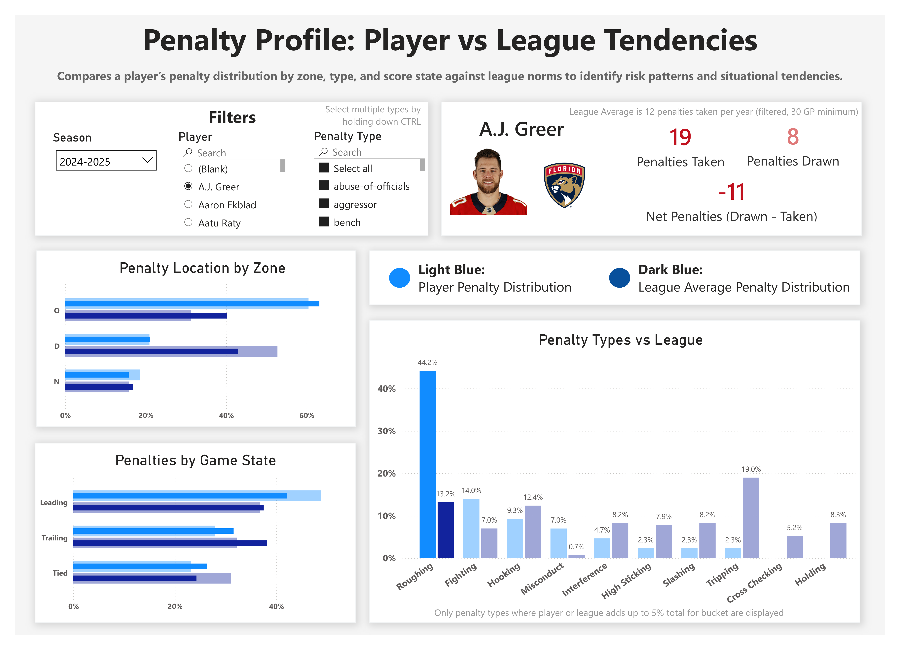
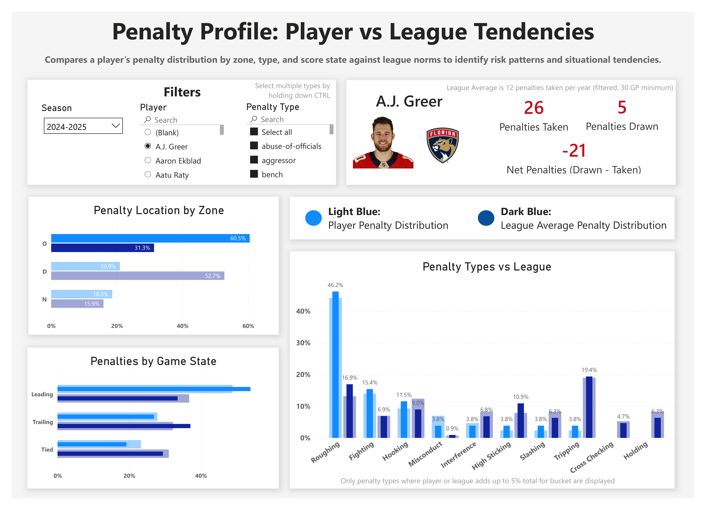

# Penalty Profile: Player vs League Tendencies - Deep Dive

## Overview

This dashboard compares a player’s penalty tendencies against league averages across:

- zone (offensive, defensive, neutral)
- game state (leading, tied, trailing)
- penalty type

It is designed to identify:
- discipline issues
- situational risk patterns
- behavioral tendencies that impact team performance

---

## Base View

---

## Key Components

### Filters (Top Left)

**Season**
- Select the season of interest

---

**Player Selection**
- Choose any player to analyze

---

**Penalty Type Filter**
- Select one or more penalty types
- Default view includes all penalty types
- Enables focused analysis (e.g., only roughing, only hooking, etc.)

---

## Player Summary Card

Displays:
- **Penalties Taken**
- **Penalties Drawn**
- **Net Penalties (Drawn – Taken)**

Color logic:
- Green → positive impact (draws more than takes)
- Red → negative impact (takes more than draws)

⚠️ Important:
- Values update dynamically based on filters and selections

---

## Main Visuals

### 1. Penalty Location by Zone

Compares where a player takes penalties vs league average:

- Offensive Zone (O)
- Defensive Zone (D)
- Neutral Zone (N)

Insight:
- Identifies *where* penalties are being taken relative to the league

---

### 2. Penalties by Game State

Compares penalty tendencies based on game situation:

- Leading
- Tied
- Trailing

Insight:
- Reveals whether a player is disciplined in high-leverage situations

---

### 3. Penalty Types vs League

Breaks down penalty distribution by type:

- Roughing
- Fighting
- Hooking
- High-sticking
- Slashing
- Tripping
- etc.

Insight:
- Identifies *what types* of penalties the player takes more or less frequently than the league

---

## Key Insight (Base View)

Using A.J. Greer as an example:

- Takes significantly more penalties than league average
- Over-indexes heavily in the **offensive zone**
- Takes more penalties when **leading**

### Why this matters

- Offensive zone penalties are generally considered **highly negative**
  - they kill offensive pressure
  - they give the opponent an easy opportunity

- Taking penalties while leading:
  - increases the chance of losing the lead
  - introduces unnecessary risk

👉 Initial conclusion:
This player demonstrates **discipline issues in high-impact situations**

---

## Interactive Behavior

### Cross-Filtering Across All Charts

Clicking any element:
- filters all visuals
- updates player card
- highlights filtered values vs original values

This enables multi-dimensional analysis.

---

## Example 1: Isolating Roughing Penalties

### What Changed

- "Roughing" selected in penalty type chart
- All visuals update to reflect only roughing penalties

---

### Insights

- Player took **19 roughing penalties**
- Net penalties = **-11** → not offsetting (this is a bad sign)

#### Important Observation

- Roughing penalties occur more when **tied or trailing**
- Fewer when leading

👉 Interpretation:
- These may be **emotion-driven or momentum-driven penalties**
- Potentially used to “spark the team”

This is a **more positive behavioral signal** than the base view suggested

---

## Example 2: Isolating Offensive Zone Penalties

### What Changed

- Offensive zone selected in zone chart
- All visuals update to reflect only offensive zone penalties

---

### Insights

- Net penalties = **-21** → extremely negative impact
- Penalties increase when **leading**

#### Penalty Type Breakdown

Not driven by a single type:
- Roughing ↑
- Hooking ↑
- High-sticking ↑
- Slashing ↑
- Tripping ↑

👉 Interpretation:
- This is not a situational issue tied to one behavior,
- Rather it reflects **general lack of discipline in offensive situations**

---

## Why This Matters

This dashboard enables multiple real-world use cases:

### 1. Coaching & Player Development

- Identify when and where players take bad penalties
- Focus discipline coaching on:
  - offensive zone awareness
  - protecting leads

---

### 2. Game Strategy

- Adjust deployment based on game state
- Avoid using high-risk players in key moments

---

### 3. Player Evaluation (Management / Scouting)

- Assess whether a player is a liability
- Determine if penalties are:
  - situational
  - behavioral
  - systemic

---

## Key Takeaways

This dashboard demonstrates how combining:

- spatial context (zone)
- situational context (game state)
- behavioral breakdown (penalty type)

with **interactive filtering**

allows analysts to:

- move beyond surface-level stats
- diagnose root causes of behavior
- generate actionable insights for hockey operations

---

## Summary

Penalty data is often misunderstood without context.

This dashboard transforms raw penalty counts into:

- situational awareness
- behavioral insights
- actionable coaching and management decisions

It highlights that:
> *when and where a penalty occurs is just as important as how often it happens.*
