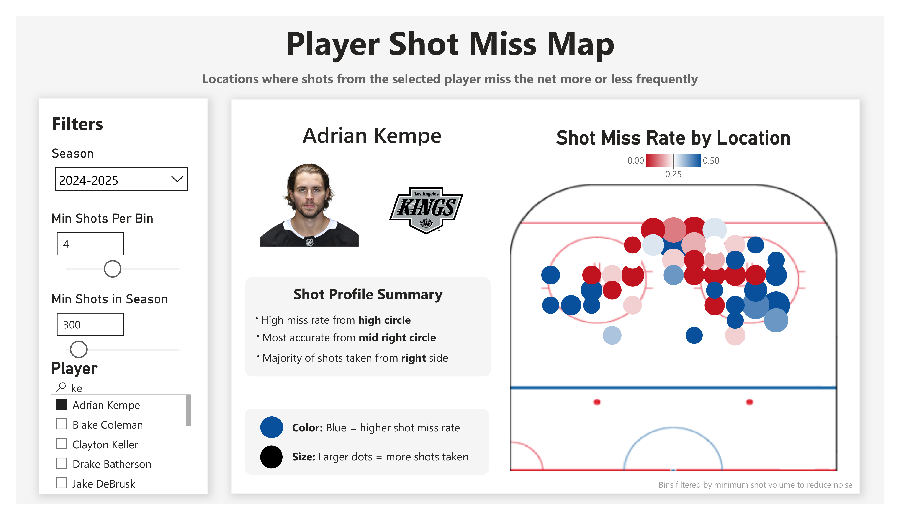
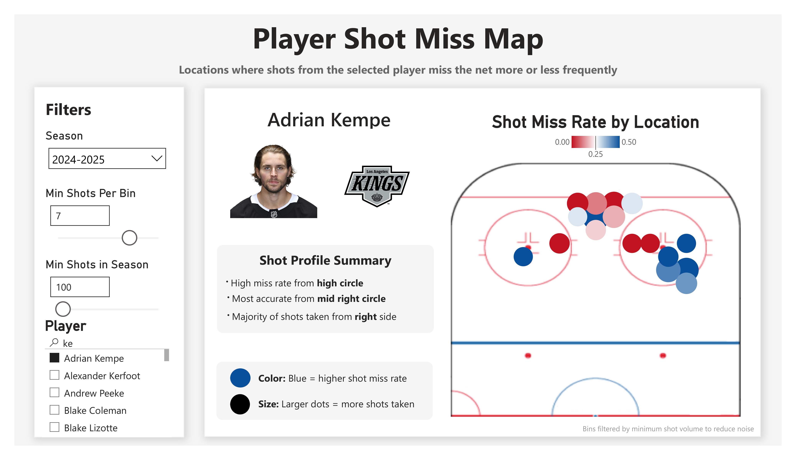

# Shot Miss Map — Deep Dive

## Overview

This dashboard visualizes where a player misses the net more or less frequently across the offensive zone.

It combines:
- spatial binning
- shot volume filtering
- interactive thresholds

to produce a clear view of shooting accuracy by location.

---

## Base View

### Key Components

**Filters (left panel):**
- Season selection
- Minimum shots per bin
- Minimum shots in season
- Player selection

**Visualization (right panel):**
- Each dot represents a location bin
- Color:
  - Blue → higher miss rate
  - Red → lower miss rate (more accurate)
- Size:
  - Larger dots → more shots taken

---

## Key Insight

This dashboard supports two primary use cases:

### 1. Player Development

Coaches can identify where a player struggles to hit the net.

Example:
- John Carlson shows high miss rates from the blue line
- This suggests a need to improve shot accuracy from distance

---

### 2. Defensive Strategy

Teams can identify where opposing players are most dangerous.

- Red zones indicate high shooting accuracy
- Defenders can prioritize limiting shots from these areas
- Goalies can anticipate higher risk from these locations

---

## Effect of Shot Threshold Filtering

### Low Threshold (Noisy Data)

With a minimum of 4 shots per bin:
- Many bins appear
- Visualization becomes noisy
- Harder to extract meaningful patterns

---

### Higher Threshold (Cleaner Insight)

With a minimum of 7 shots per bin:
- Noise is reduced
- Clear patterns emerge

**Key Insight (Adrian Kempe):**
- High miss rate from outer/high circle
- Highly accurate in the slot and near the net

---

## Importance of Filtering

This dashboard demonstrates that:

- Raw data alone can be misleading
- Proper filtering is critical for meaningful insights
- Analysts must balance sample size vs clarity

---

## Additional Feature: Player Pool Control

The "Min Shots in Season" filter controls:
- which players appear in the selection list

Lower threshold:
- more players available
- includes lower-volume shooters

Higher threshold:
- restricts to high-volume shooters
- improves reliability of analysis

---

## Summary

This dashboard highlights how spatial analytics can be used to:

- improve player shooting decisions
- inform defensive strategy
- enhance goalie preparation
- extract meaningful insights from noisy event data

It also demonstrates the importance of interactive filtering in real-world analytics workflows.
